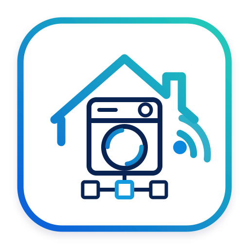

<p align="center">
  
</p>

# ioBroker HomeConnect Local Adapter

Local LAN adapter for Bosch, Siemens and other BSH Home Connect appliances.

The adapter talks to Home Connect appliances directly in the local network instead of using the Home Connect cloud API during runtime. It uses local appliance profiles containing the device key, feature mapping and device description.

> **Project status:** experimental but already usable for local monitoring and selected local control/write tests. The object schema can still change while the adapter is developed.

## Current project status

Implemented now:

- Local AES WebSocket transport: `ws://<ip>:80/homeconnect`.
- Experimental local TLS-PSK WebSocket transport: `wss://<ip>:443/homeconnect`.
- Home Connect local handshake including `/ei/initialValues`, `/ci/services`, optional authentication/info requests and RO reads.
- Profile folder scan for profile ZIP files and extracted profiles.
- Recursive profile loading and de-duplication by `haId`.
- Automatic device suggestions in the adapter config from scanned profiles.
- Optional mDNS discovery through `_homeconnect._tcp.local`.
- Optional automatic host/IP updates from safe mDNS matches.
- Optional automatic enable/add of safely matched discovered appliances when a matching profile ZIP exists.
- Device table with metadata such as type, brand, VIB, MAC, connection type and profile file.
- Cloud-adapter-like online indicator via `<device>.general.connected`.
- Dynamic state creation from `FeatureMapping.xml` and live `/ro/*` values.
- Enum translation from the downloaded device descriptions plus selected German companion states.
- Diagnostic states for appliance info, network info and registered apps/devices.
- Program list states under `availablePrograms.availableList` and `availablePrograms.availableJson`.
- Cloud-compatible root program states:
  - `program.RootSelectedProgram`
  - `program.RootActiveProgram`
- Basic write support through `/ro/values` using `POST`.
- Writable `settings.PowerState` where supported by the appliance.
- Dynamic writable settings/options/program states when the appliance reports `READWRITE`.
- `commands.StartProgram` and `commands.StartProgramWithOptions` for selected-program starts.
- Filtering of dangerous commands such as factory reset, network reset, Wi-Fi deactivation and software update/download commands.
- Offline handling for appliances that are only reachable when switched on, such as washer and dryer.

Known limitations:

- Still experimental and not published as a stable ioBroker adapter package.
- TLS-PSK compatibility depends on the Node/OpenSSL environment and still needs more real-device testing.
- Write/control support is intentionally conservative and should be tested carefully per appliance type.
- The state schema is still evolving; deleting and recreating the device object tree may be useful after updates.

## Profile ZIP files

The adapter needs local Home Connect appliance profiles. These profiles include the PSK/key material and the XML files needed to map UIDs to readable feature names.

Use the Home Connect profile downloader project to create those files:

- https://github.com/bruestel/homeconnect-profile-downloader

Recommended profile directory inside the ioBroker runtime/container:

```bash
/opt/iobroker/iobroker-data/files/0_userdata.0/
```

Place the HomeConnect Local HASS ZIP files there. In ioBroker this is the `0_userdata.0` file area. The adapter scans ZIP files and extracted profile folders recursively.

A single ZIP file or a dedicated subfolder is still supported, but the `0_userdata.0` path is the most convenient default for normal ioBroker installations.

After uploading or replacing profile ZIP files, restart the adapter instance or trigger a scan so the profiles are loaded again.

## Installation from GitHub

In the ioBroker admin UI use a custom GitHub installation from:

```text
dosordie/ioBroker.homeconnect-local
```

CLI alternative:

```bash
iobroker url dosordie/ioBroker.homeconnect-local --host iobroker --debug
iobroker upload homeconnect-local
iobroker restart homeconnect-local.0
```

## Configuration

Recommended workflow with mDNS:

1. Generate/download profile ZIP files with `homeconnect-profile-downloader`.
2. Copy the ZIP files into the configured profile folder, normally `/opt/iobroker/iobroker-data/files/0_userdata.0/`.
3. Enable `enableMdnsDiscovery`.
4. Optionally enable `autoUpdateDiscoveredHosts` so existing configured devices receive the detected IP address.
5. Optionally enable `autoAddDiscoveredDevices` so safely matched devices are automatically enabled or added to the device table.
6. Save and restart the adapter.

Manual workflow without mDNS:

1. Generate/download profile ZIP files with `homeconnect-profile-downloader`.
2. Copy the ZIP files into the configured profile folder.
3. Start the adapter once.
4. The adapter adds scanned profiles to the device table as disabled suggestions.
5. Enter the appliance IP/hostname.
6. Enable the appliance row.
7. Save and restart the adapter.

Important config fields:

- `profilePath`: folder containing profile ZIPs or extracted profiles.
- `autoAddProfiles`: automatically add scanned profiles to the device table as disabled suggestions.
- `enableMdnsDiscovery`: scan the local network for Home Connect appliances via mDNS.
- `autoUpdateDiscoveredHosts`: update existing configured device hosts/IPs from safe mDNS matches.
- `autoAddDiscoveredDevices`: enable or add safely matched discovered devices when a matching profile exists.
- `host`: appliance IP address or hostname.
- `enabled`: enables the appliance connection.
- `debugRaw`: logs received raw `/ro` values for debugging. Disable after testing if personal device/app names are visible.
- `enableRawStates`: creates optional debug states under `raw.uid_<uid>` with raw Home Connect values. Defaults to `false`.

## mDNS discovery and auto-add

Discovery uses the local service:

```text
_homeconnect._tcp.local
```

The adapter exposes discovery results under:

```text
homeconnect-local.0.discovery.enabled
homeconnect-local.0.discovery.lastScan
homeconnect-local.0.discovery.count
homeconnect-local.0.discovery.foundJson
homeconnect-local.0.discovery.matchedJson
homeconnect-local.0.discovery.unmatchedJson
homeconnect-local.0.discovery.matchedCount
homeconnect-local.0.discovery.unmatchedCount
homeconnect-local.0.discovery.updatedHostsCount
homeconnect-local.0.discovery.updatedHostsJson
homeconnect-local.0.discovery.addedDevicesCount
homeconnect-local.0.discovery.addedDevicesJson
homeconnect-local.0.discovery.enabledDevicesCount
homeconnect-local.0.discovery.enabledDevicesJson
homeconnect-local.0.discovery.scanNow
```

Safe automatic actions are conservative:

- `haId` matches may be used automatically.
- MAC matches may be used automatically.
- Brand/type/VIB-only matches are displayed but not auto-added or auto-updated.
- Unmatched discoveries are displayed but not used for automatic configuration changes.
- Discovered IP addresses are preferred over `.local` hostnames.
- Keys, IVs, connection type and profile metadata always come from the profile ZIP, not from mDNS.

When mDNS changes the adapter native configuration during startup, ioBroker may restart the instance. This is expected. The adapter stops the current startup run and connects appliances after the next clean start.

## Object layout

Example structure:

```text
homeconnect-local.0.<haId>.general.*
homeconnect-local.0.<haId>.info.*
homeconnect-local.0.<haId>.network.*
homeconnect-local.0.<haId>.registeredDevices.*
homeconnect-local.0.<haId>.status.*
homeconnect-local.0.<haId>.program.*
homeconnect-local.0.<haId>.availablePrograms.*
homeconnect-local.0.<haId>.options.*
homeconnect-local.0.<haId>.settings.*
homeconnect-local.0.<haId>.events.*
homeconnect-local.0.<haId>.phases.*
homeconnect-local.0.<haId>.commands.*
homeconnect-local.0.<haId>.expertCommands.*
homeconnect-local.0.<haId>.raw.uid_<uid> (optional, only if enableRawStates=true)
```

Important states:

```text
general.connected
info.reconnecting
info.lastSeen
info.lastError
program.RootSelectedProgram
program.RootActiveProgram
program.selectedProgramName
program.activeProgramName
program.startProgramName
program.startOptionsJson
availablePrograms.availableList
availablePrograms.availableJson
settings.PowerState
commands.StartProgram
commands.StartProgramWithOptions
status.eventSummary_de
status.activeEventsJson
```

`general.connected` is used as the ioBroker device online indicator, similar to the official cloud Home Connect adapter.

## Program selection and start commands

The adapter provides several program-related states. The most important ones are:

```text
program.RootSelectedProgram
program.RootActiveProgram
program.startProgramName
program.startOptionsJson
commands.StartProgram
commands.StartProgramWithOptions
```

`program.RootSelectedProgram` is a cloud-adapter-compatible alias for the selected program. Writing this state selects a program on the appliance if the appliance allows selected-program writes.

`program.RootActiveProgram` is a cloud-adapter-compatible alias for the active program. It is mainly useful for status display. Direct writes to active program may immediately start a program on some appliances and should be used carefully.

`program.startProgramName` is a convenience state. Writing a known program name resolves it to the raw program UID and starts through the adapter start logic.

### `commands.StartProgram`

`commands.StartProgram` starts the currently selected program.

It uses the currently known and safe program option states automatically. The adapter only adds automatic options when the option context belongs to the selected program. This avoids accidentally sending stale options from another program.

Typical use:

```text
1. Write program.RootSelectedProgram or select the program at the appliance.
2. Write true to commands.StartProgram.
3. The adapter resets the command state back to false.
```

### `commands.StartProgramWithOptions`

`commands.StartProgramWithOptions` also starts the currently selected program, but it additionally reads explicit options from:

```text
program.startOptionsJson
```

Explicit options from `program.startOptionsJson` win over automatic options for the same UID.

Example:

```json
{
  "finish_in": 7200,
  "options": {
    "Dishcare.Dishwasher.Option.IntensivZone": false,
    "Dishcare.Dishwasher.Option.VarioSpeedPlus": true
  }
}
```

Then trigger:

```text
commands.StartProgramWithOptions = true
```

`start_in` and `finish_in` may be seconds or an object:

```json
{
  "start_in": {
    "hours": 1,
    "minutes": 30
  }
}
```

The `options` object accepts feature names or numeric UID strings. Values are converted through the profile mapping before they are sent to the appliance.

## Command states

`commands.*` states are ioBroker button-like boolean states:

```text
write true  -> execute command
write false -> ignored/reset value
```

After a command is handled, the adapter writes the command state back to `false` with `ack=true`.

Normal commands are sent through local `/ro/values` as command UID with `value=true`. Start commands are special and use `/ro/activeProgram` with a program UID and optional option list.

## German companion states

For selected enum/status states the adapter writes German companion states with suffix `_de` and raw numeric states with suffix `_raw`.

Examples:

```text
status.DoorState
status.DoorState_de
status.DoorState_raw
phases.ProcessPhase
phases.ProcessPhase_de
phases.ProcessPhase_raw
status.ProgramRunDetail.EndTrigger
status.ProgramRunDetail.EndTrigger_de
status.ProgramRunDetail.EndTrigger_raw
```

Known examples:

```text
DoorState Open   -> Offen
DoorState Closed -> Geschlossen
DoorState Locked -> Verriegelt
DoorState Ajar   -> Angelehnt
```

German companion states are currently written for `status`, `phases` and `program` categories. Generic `options` and `settings` states usually use their normal state value plus metadata instead of a `_de` companion state.

## Event summary

Individual Home Connect events are available under:

```text
events.*
```

The adapter also writes a German event summary:

```text
status.eventSummary_de
status.activeEventsJson
```

`status.eventSummary_de` is intended for visualization. Harmless informational events such as a finished program may be suppressed from the active warning summary.

## Write/control safety

The adapter only writes through local Home Connect endpoints and is intentionally conservative.

Writes are mainly enabled when the appliance reports `READWRITE` for the corresponding UID. Some program options are considered writable when the selected program description marks them as writable, even if the global live option state is not writable outside a program context.

Dangerous commands are blocked from normal `commands.*` creation and are only listed under:

```text
expertCommands.blockedList
```

Currently blocked command markers include:

```text
FactoryReset
NetworkReset
DeactivateWiFi
AllowSoftwareUpdate
AllowSoftwareDownload
SoftwareUpdate
SoftwareDownload
```

## Offline appliances

Some appliances, especially washers and dryers, may only be reachable when switched on. This is expected.

The adapter treats failed local socket connections as offline state, not as a fatal adapter error. It reconnects periodically and updates:

```text
general.connected
info.reconnecting
info.lastError
```

## Protocol notes

Local AES mode uses:

- URL: `ws://<ip>:80/homeconnect`
- WebSocket binary frames
- AES-256-CBC stream encryption
- HMAC-SHA256 authentication truncated to 16 bytes
- PSK and IV from the downloaded device profile

Local TLS mode uses:

- URL: `wss://<ip>:443/homeconnect`
- TLS 1.2 with PSK from the downloaded device profile
- Plain Home Connect JSON messages inside the protected WebSocket

Typical local handshake:

1. Appliance sends `/ei/initialValues`.
2. Client responds with app identity.
3. Client requests `/ci/services`.
4. Optional `/ci/authentication` and `/ci/info` depending on CI version.
5. Optional `/iz/info`, `/ei/deviceReady`, `/ni/info` and `/ci/registeredDevices` depending on advertised services.
6. Client requests `/ro/allDescriptionChanges` and `/ro/allMandatoryValues`.
7. Live updates arrive through `/ro/values` and related `/ro/*` notifications.

## Credits / references

This adapter is MIT licensed. It was built from local protocol observations and the following reference projects:

- https://github.com/bruestel/homeconnect-profile-downloader
- https://github.com/chris-mc1/homeconnect_local_hass
- https://github.com/chris-mc1/homeconnect_websocket
- https://github.com/osresearch/hcpy
- https://github.com/stakach/homeconnect_crystal

## Development

```bash
npm install
npm run build
```
